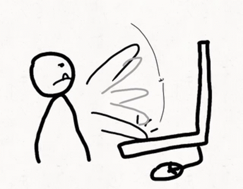

<!--
**kushagra-goyal-14/kushagra-goyal-14** is a ✨ _special_ ✨ repository because its `README.md` (this file) appears on your GitHub profile.

Here are some ideas to get you started:

- 🔭 I’m currently working on ...
- 🌱 I’m currently learning ...
- 👯 I’m looking to collaborate on ...
- 🤔 I’m looking for help with ...
- 💬 Ask me about ...
- 📫 How to reach me: ...
- 😄 Pronouns: ...
- ⚡ Fun fact: ...
-->

<h1 align="center"><b>Hi</b> , I'm <b>Kushagra Goyal </b></h1>

<h3 align="Justify"> 🙋‍♂️ Hi there! I am a full stack developer 💻 working with JavaScript and currently studying <strong>Computer Science 📚 </strong>. I am always eager to learn new technologies and <b>improve</b> my skillset 🤓. As a full stack developer, I have experience in both front-end and back-end development 🌐 and enjoy working on projects that involve both aspects. Let's create something great together! 🤝</h3>

 
- 🔭 &nbsp;  I am currently working on JS Projects. 
- 🌱 &nbsp;  Following MERN Stack. 
- ✊ &nbsp;  Working on C++, C, Javascript, React, and Node-JS. 
- 💬 &nbsp;  Ask me anything, I am always happy to help. 

 

[]
&emsp;

<h3 align="center">Connect with me:</h3>

&emsp;

&emsp;

